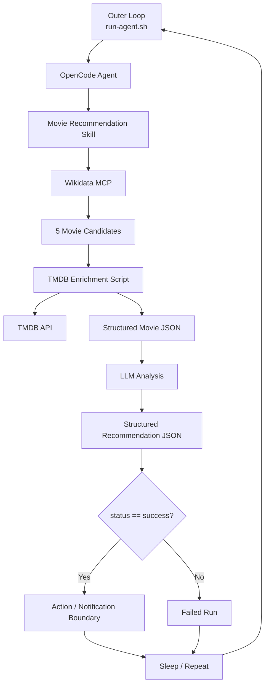

# Autonomous Movie Recommendation Agent


[](https://opencode.ai/)
[](https://www.docker.com/)
[](https://www.gnu.org/software/bash/)
[](https://www.wikidata.org/wiki/Wikidata:MCP)
[](https://agentskills.io/specification)
[](https://developer.themoviedb.org/)

A deliberately small autonomous AI agent built to learn and demonstrate the core building blocks of an agentic workflow:

**LLM + MCP + Skill + deterministic tools + evaluation + action + outer loop + Docker**

This is not intended to be a production movie recommendation system. It is a compact, reproducible learning project for understanding how these pieces fit together in a real running agent.

## Table of Contents

- [What It Demonstrates](#what-it-demonstrates)
- [Architecture](#architecture)
- [The Workflow](#the-workflow)
- [Why Build This?](#why-build-this)
- [Project Structure](#project-structure)
- [Run It](#run-it)
- [Credentials](#credentials)
- [Design Lessons](#design-lessons)
- [Current Limitations](#current-limitations)
- [Next Experiments](#next-experiments)
- [Attribution](#attribution)
  - [TMDB](#tmdb)
  - [Wikidata](#wikidata)
  - [OpenCode](#opencode)
  - [Agent Skills](#agent-skills)
  - [NVIDIA Nemotron](#nvidia-nemotron)

- [License](#license)

## What It Demonstrates

| Pattern             | Implementation                    |
| ------------------- | --------------------------------- |
| Agent runtime       | OpenCode                          |
| LLM                 | NVIDIA Nemotron-3 Ultra 550B A55B |
| MCP                 | Wikidata MCP                      |
| Agent Skill         | `movie-recommendation`            |
| Deterministic tool  | `enrich_movies.sh`                |
| Candidate discovery | Wikidata SPARQL                   |
| Movie enrichment    | TMDB API                          |
| Evaluation          | Highest TMDB rating               |
| Output contract     | Structured JSON                   |
| Success condition   | `status == success`               |
| Action              | Demonstration via stdout          |
| Outer loop          | Bash + configurable interval      |
| Runtime isolation   | Docker                            |

## Architecture



## The Workflow

Each run follows the same basic pipeline:

1. **Discover** — the Skill instructs the agent to run a fixed Wikidata SPARQL query for the five most recent English-language US movies in the selected window.
2. **Enrich** — the agent passes the resulting TMDB IDs to the deterministic TMDB enrichment script.
3. **Analyze** — the LLM evaluates the successfully enriched candidates.
4. **Recommend** — the current selection rule chooses the highest-rated candidate.
5. **Return** — the agent produces a machine-readable JSON result.
6. **Evaluate** — the outer wrapper checks the `status` field.
7. **Act** — successful results are surfaced as the demonstration action.
8. **Repeat** — the wrapper sleeps for the configured interval and starts another run.

Example final agent payload:

```json
{
  "status": "success",
  "recommendation": {
    "title": "Obsession",
    "tmdb_id": 1339713,
    "tmdb_rating": 8.232,
    "vote_count": 4440,
    "reason": "Highest TMDB rating among enriched candidates"
  }
}
```

The important boundary is that OpenCode emits many execution events, but the outer wrapper extracts only the final text event and treats that JSON as the agent's external result.

## Why Build This?

The goal was to answer a practical question:

> **What is the minimum architecture required to build an autonomous agent that can observe, reason, use tools, evaluate its result, act, and repeat?**

The project intentionally avoids heavyweight orchestration frameworks, databases, queues, Kubernetes, or production notification infrastructure. The point is to make the agentic pattern visible.

## Project Structure

```text
.
├── Dockerfile
├── .dockerignore
├── opencode.json
├── run-agent.sh
├── movie-agent.gif
└── .opencode/
    └── skills/
        └── movie-recommendation/
            ├── SKILL.md
            └── scripts/
                └── enrich_movies.sh
```

### Key files

- **`run-agent.sh`** — outer loop, JSON extraction, success condition, action, and configurable sleep interval.
- **`opencode.json`** — OpenCode configuration and MCP setup.
- **`SKILL.md`** — workflow instructions provided to the agent.
- **`enrich_movies.sh`** — deterministic TMDB API integration and JSON shaping.
- **`Dockerfile`** — packages the complete runtime.

## Run It

### Requirements

- Docker
- NVIDIA API key
- TMDB API token

### Build

```bash
docker build -t autonomous-agent .
```

### Run

```bash
docker run --rm \
  -e NVIDIA_API_KEY="$NVIDIA_API_KEY" \
  -e TMDB_API_TOKEN="$TMDB_API_TOKEN" \
  -e INTERVAL_SECONDS=300 \
  autonomous-agent
```

For rapid testing:

```bash
docker run --rm \
  -e NVIDIA_API_KEY="$NVIDIA_API_KEY" \
  -e TMDB_API_TOKEN="$TMDB_API_TOKEN" \
  -e INTERVAL_SECONDS=30 \
  autonomous-agent
```

The interval is configurable through `INTERVAL_SECONDS`.

## Credentials

API credentials are supplied at runtime through environment variables:

- `NVIDIA_API_KEY`
- `TMDB_API_TOKEN`

No credentials are stored in the repository or baked into the Docker image.

The TMDB token is consumed by the enrichment script rather than exposed as part of the model's reasoning context.

## Design Lessons

### Deterministic Logic vs. LLM Reasoning

Candidate selection and TMDB enrichment are deliberately deterministic.

The LLM is used for the part where reasoning is useful: analyzing the resulting movie data and producing a recommendation.

### MCP Is the Tool Boundary

The Wikidata MCP provides the agent with a structured way to query Wikidata rather than relying on generic web fetching.

### Skills Are Instructions, Not the Whole Orchestration Engine

The `movie-recommendation` Skill defines the workflow and tells the agent which tools and scripts to use.

The actual repeated execution and success condition live outside the Skill in `run-agent.sh`.

### Structured Output Creates an Integration Boundary

OpenCode's `--format json` emits JSON events.

The wrapper selects the final text event and turns the agent's response into a clean JSON payload that could be handed to a notification or downstream action system.

### Failure Tolerance

TMDB requests can occasionally fail transiently.

The enrichment script retries individual IDs and the workflow continues with successfully enriched candidates.

This project intentionally favors a simple resilient prototype over pretending to provide production-grade reliability.

## Current Limitations

- Recommendation logic is intentionally simple: highest TMDB rating wins.
- TMDB network/API failures can still produce partial results.
- The action is currently demonstrated with stdout rather than a real notification service.
- There is no persistent state or deduplication between runs.
- The outer loop is a Bash process rather than a production scheduler.

## Next Experiments

Possible extensions without changing the core architecture:

```text
Current

Discovery
    ↓
Enrichment
    ↓
Analysis
    ↓
Recommendation
    ↓
Action
    ↓
Loop


Next

Taste / preference signals
    ↓
Better evaluation criteria
    ↓
Real notification
    ↓
Persistent state / deduplication
    ↓
More autonomous actions
```

## Attribution

### TMDB

Movie metadata and ratings are retrieved from **TMDB (The Movie Database)** through its API.

> This product uses the TMDB API but is not endorsed or certified by TMDB.


TMDB attribution and branding information:

https://developer.themoviedb.org/docs/faq

### Wikidata

Candidate discovery uses Wikidata and the Wikidata MCP service.

- Wikidata: https://www.wikidata.org/
- Wikidata MCP: https://www.wikidata.org/wiki/Wikidata:MCP

### OpenCode

The agent runtime is [OpenCode](https://opencode.ai/), an open-source AI coding agent.

This project is **not built by, affiliated with, or endorsed by the OpenCode team**.

### Agent Skills

The project follows the Agent Skills directory and `SKILL.md` conventions described by the Agent Skills specification:

https://agentskills.io/specification

### NVIDIA Nemotron

The reasoning model used during development is **NVIDIA Nemotron-3 Ultra 550B A55B** through NVIDIA's API platform.

## License

This project is licensed under the **MIT License**.

See [`LICENSE`](LICENSE) for the full license text.

---

Built as a hands-on exploration of autonomous agent architecture — from **MCP and Skills to deterministic tools, structured results, actions, and an outer loop**.
