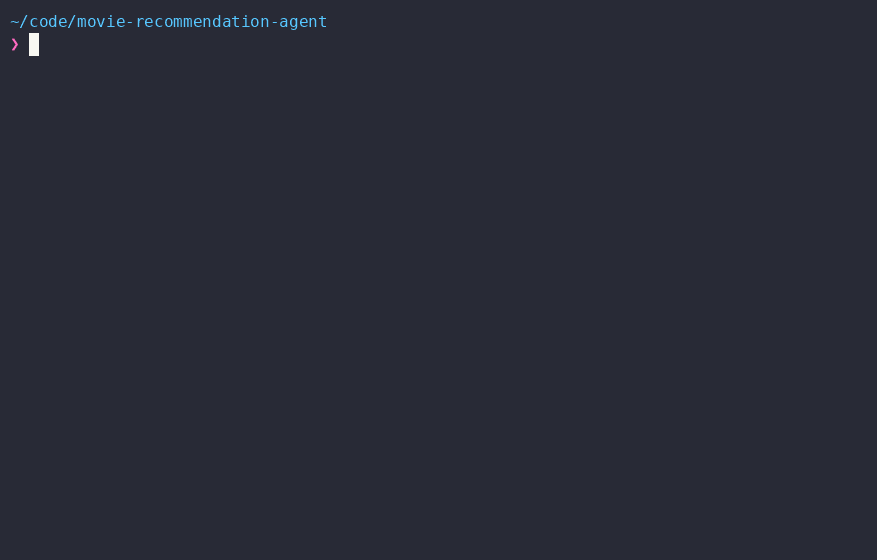
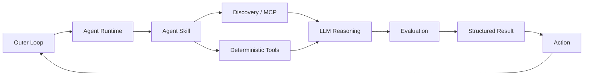

# Autonomous Movie Recommendation Agent

<p align="center">
  
</p>

[](https://www.docker.com/)
[](https://opencode.ai/)
[](https://modelcontextprotocol.io/)
[](https://agentskills.io/specification)
[](https://developer.themoviedb.org/)
[](LICENSE)

A working reference implementation for **deploying an autonomous AI agent harness as a containerized, repeatable workload**.

The movie recommender is the example workload. The architecture is intentionally built from replaceable pieces: an agent runtime, model, skills, tool interfaces, deterministic scripts, evaluation, an action boundary, and an outer execution loop.

## Table of Contents

- [Architecture](#architecture)
- [What It Demonstrates](#what-it-demonstrates)
- [Workflow](#workflow)
- [Why This Architecture](#why-this-architecture)
- [Project Structure](#project-structure)
- [Run It](#run-it)
- [Credentials](#credentials)
- [Design Principles](#design-principles)
- [Prototype Boundaries](#prototype-boundaries)
- [Extending It](#extending-it)
- [Attribution](#attribution)
- [License](#license)

## Architecture

The architecture separates reasoning from tools, deterministic execution, evaluation, actions, and scheduling.



This repository implements that pattern with OpenCode, NVIDIA Nemotron, Wikidata MCP, a TMDB enrichment script, a simple rating evaluator, and stdout as the current action.

## What It Demonstrates

| Capability          | This implementation               | Replaceable with                           |
| ------------------- | --------------------------------- | ------------------------------------------ |
| Agent runtime       | OpenCode                          | Claude Code, Codex, Copilot CLI, etc.      |
| Model               | NVIDIA Nemotron-3 Ultra 550B A55B | Any compatible model/provider              |
| Tool interface      | Wikidata MCP                      | Other MCP/tool interfaces                  |
| Agent instructions  | Agent Skill                       | Equivalent skill/instruction layer         |
| Deterministic tools | Bash + TMDB API                   | Python, Go, services, APIs                 |
| Evaluation          | Highest TMDB rating               | Rules, LLM judge, policies, custom metrics |
| Output              | Structured JSON                   | Any downstream contract                    |
| Action              | stdout                            | Notification, webhook, API, queue          |
| Outer loop          | Bash + interval                   | Cron, scheduler, worker, Kubernetes        |
| Runtime             | Docker                            | Other container/compute environments       |

The components are implementation choices, not architectural requirements.

## Workflow

Each run follows the same pattern:

1. **Discover** - query Wikidata for recent movie candidates.
2. **Enrich** - fetch movie details and credits from TMDB.
3. **Reason** - analyze the enriched candidates with the LLM.
4. **Evaluate** - apply the current recommendation rule.
5. **Return** - produce a structured JSON result.
6. **Action** - surface successful results at the action boundary.
7. **Repeat** - the outer loop starts the next run.

Current movie-specific selection logic is intentionally simple: **highest TMDB rating among successfully enriched candidates**.

Example result:

```json
{
  "status": "success",
  "recommendation": {
    "title": "Obsession",
    "tmdb_id": 1339713,
    "tmdb_rating": 8.232,
    "vote_count": 4440,
    "reason": "Highest TMDB rating among enriched candidates"
  }
}
```

OpenCode produces execution events during a run. The wrapper extracts the final text event and treats the JSON inside it as the agent's external result.

## Why This Architecture

The useful boundary is not "LLM does everything."

```text
LLM reasoning
     ≠
tool access
     ≠
deterministic execution
     ≠
evaluation
     ≠
action
     ≠
scheduling
     ≠
runtime
```

Each part can evolve independently.

For example, the movie rating evaluator could later become a multi-factor scoring model, an LLM judge, a safety policy, or a human approval step without changing the outer execution model.

Likewise, stdout is only the current action. It can become a Slack message, webhook, API call, or another downstream workflow.

## Project Structure

```text
.
├── Dockerfile
├── .dockerignore
├── opencode.json
├── run-agent.sh
├── movie-agent.gif
└── .opencode/
    └── skills/
        └── movie-recommendation/
            ├── SKILL.md
            └── scripts/
                └── enrich_movies.sh
```

### Key files

- **`run-agent.sh`** - outer loop, JSON extraction, success check, action, and interval.
- **`opencode.json`** - agent runtime configuration and MCP setup.
- **`SKILL.md`** - workflow instructions provided to the agent.
- **`enrich_movies.sh`** - deterministic TMDB integration and JSON shaping.
- **`Dockerfile`** - packages the complete runtime.

## Run It

### Requirements

- Docker
- NVIDIA API key
- TMDB API token

### Build

```bash
docker build -t autonomous-agent .
```

### Run

```bash
docker run --rm \
  -e NVIDIA_API_KEY="$NVIDIA_API_KEY" \
  -e TMDB_API_TOKEN="$TMDB_API_TOKEN" \
  -e INTERVAL_SECONDS=300 \
  autonomous-agent
```

For rapid testing:

```bash
docker run --rm \
  -e NVIDIA_API_KEY="$NVIDIA_API_KEY" \
  -e TMDB_API_TOKEN="$TMDB_API_TOKEN" \
  -e INTERVAL_SECONDS=30 \
  autonomous-agent
```

`INTERVAL_SECONDS` controls the time between runs.

## Credentials

Credentials are supplied at runtime:

- `NVIDIA_API_KEY`
- `TMDB_API_TOKEN`

They are not stored in the repository or baked into the image.

The TMDB token is consumed by the enrichment script rather than placed in the model's reasoning context.

## Design Principles

### Deterministic work stays deterministic

API calls, data shaping, retries, and other predictable operations are handled by scripts rather than delegated to the LLM.

### MCP is the tool boundary

The Wikidata MCP gives the agent a structured capability for candidate discovery instead of relying on generic web fetching.

### Skills define behavior

The Skill describes the workflow and how the agent should use its available capabilities. Repeated execution and success handling live outside the Skill.

### Structured output is the integration boundary

The agent's final JSON result gives the outer system a small, machine-readable contract instead of coupling downstream logic to the agent's execution stream.

### The outer loop provides autonomy over time

The agent does not need to own its scheduler. The wrapper starts runs, checks results, performs the current action, and repeats.

## Prototype Boundaries

This is a reference implementation, not a production framework.

- Recommendation logic is intentionally simple.
- TMDB can experience transient API/network failures.
- The action is currently demonstrated with stdout.
- There is no persistent state or deduplication.
- Bash is used as the scheduler/outer loop.
- Production observability and notification infrastructure are intentionally out of scope.

## Extending It

The architecture can evolve without replacing its core pieces:

```text
Current
Discovery → Enrichment → Reasoning → Evaluation → Action → Loop

Possible extensions
Discovery → Enrichment → Reasoning → Rich Evaluation
                                      ↓
                              Preference / Policy
                                      ↓
                              Notification / API
                                      ↓
                              Persistent State
                                      ↓
                                    Loop
```

The same pattern can be applied to workloads other than movie recommendations.

## Attribution

### TMDB

<p>
  
</p>

Movie metadata and ratings are retrieved from **TMDB (The Movie Database)** through its API.

> This product uses the TMDB API but is not endorsed or certified by TMDB.

TMDB attribution and branding information:  
https://developer.themoviedb.org/docs/faq

### Wikidata

<p>
  
</p>

Candidate discovery uses Wikidata and the Wikidata MCP service.

- https://www.wikidata.org/
- https://www.wikidata.org/wiki/Wikidata:MCP

### OpenCode

<p>
  
</p>

The agent runtime is [OpenCode](https://opencode.ai/), an open-source AI coding agent.

This project is **not built by, affiliated with, or endorsed by the OpenCode team**.

### Agent Skills

<p>
  
</p>

The project follows the Agent Skills `SKILL.md` conventions described by the Agent Skills specification:

https://agentskills.io/specification

### NVIDIA

<p>
  
</p>

The agent uses **NVIDIA Nemotron-3 Ultra 550B A55B** for reasoning through the
**NVIDIA Build** model API platform.

NVIDIA Build provides access to NVIDIA NIM inference APIs and a catalog of
models that can be used through hosted endpoints or deployed on your own
GPU infrastructure. :contentReference[oaicite:1]{index=1}

Model catalog and API access:  
https://build.nvidia.com/models

## License

This project is licensed under the **MIT License**.

See [`LICENSE`](LICENSE) for the full license text.

---

Built as a hands-on reference implementation of autonomous agent architecture - from **MCP and Skills to deterministic tools, structured results, actions, and an outer loop**.
